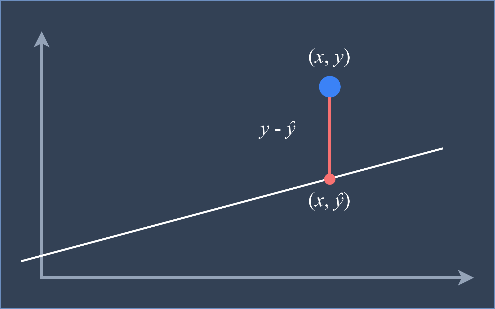

# Course Information

  

|                      | Detail                                                   |
| -------------------- | -------------------------------------------------------- |
| **Course Title**     | Hands-on Machine Learning: Linear Regression with Python |
| **Course Number**    | HML001EN                                                 |
| **Length**           | 7-8 hours                                                |
| **Difficulty Level** | Introductory                                             |
| **Subjects**         | Artifical Intelligence, Machine Learning                 |
| **Language**         | English                                                  |
| **Organization**     | SoleilDataDojo                                           |
| **Course Type**      | Self-paced                                               |

## Short Description

A practical approach to learn the basics and build your own Linear Regression
model using Numpy, an open-source and fundamental library for scientific
computing in Python.

## Long Description

In this course, you will gain practical experience about building your own
Linear Regression model using Python and NumPy. In addition, you'll learn about
some of the best practices in exploratory data analysis and machine learning
through coding exercises. A real-world dataset is used in this course so that
you'll learn how to quickly and powerfully apply these skills and techniques to
new problems or to your own projects.

## What You Will Learn

- Concepts behind Linear Regression
- Applying Linear Regression to solve real-world problems
- Basic Exploratory Data Analysis includes loading data and creating informative
  visualizations

## Skill and Knowledge Prerequistes

- Basic knowledge of linear algebra is necessary to understand the concepts
  behind Linear Regression.

- Familiarity with Python programming and data processing libraries such as
  NumPy and Matplotlib.

## Syllabus

1. Welcome

2. Introduction to Linear Regression

   Discover the basic concepts of Linear Regression.

3. Building Linear regression model

   Work through a set of Juypyter Notebooks to implement Linear Regression
   models using NumPy.

4. Linear Regression with real-world dataset

   Use your Linear Regression model in more challenging real-world dataset.

5. Summary

   Course summarization and going further with Linear Regression.

## References

- Research existing resources for references:

  1. https://web.stanford.edu/~hastie/MOOC-Slides/linear_regression.pdf

  2. https://www.stat.yale.edu/Courses/1997-98/101/linreg.htm
  3. https://www.kaggle.com/faressayah/linear-regression-house-price-prediction
  4. https://www.kaggle.com/sudhirnl7/linear-regression-tutorial
  5. https://www.kaggle.com/nitindatta/fifa-in-depth-analysis-with-linear-regression
  6. https://machinelearningmastery.com/simple-linear-regression-tutorial-for-machine-learning/
  7. https://stattrek.com/tutorials/regression-tutorial.aspx
  8. https://www.tutorialandexample.com/linear-regression-tutorial/
